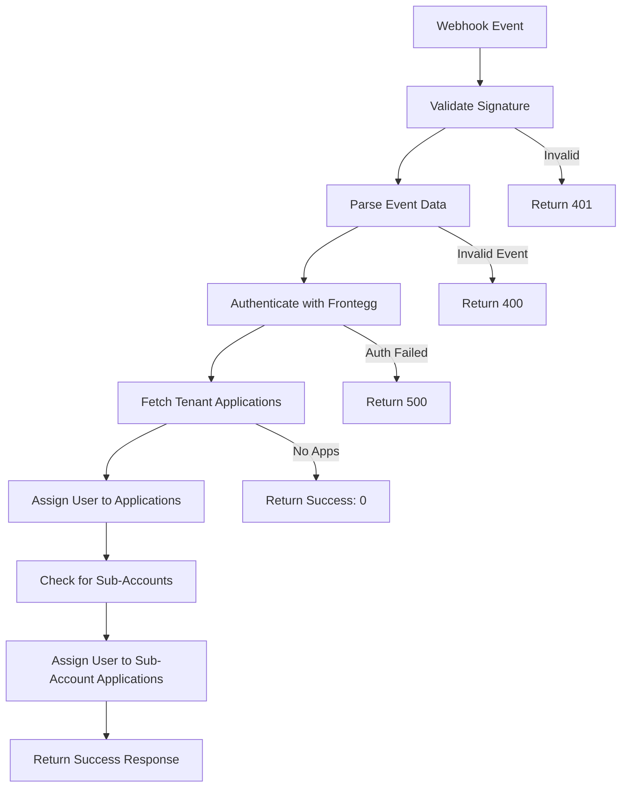

# Frontegg Webhook Service

[](https://nodejs.org/)
[](https://opensource.org/licenses/ISC)
[](https://vercel.com)

A robust Node.js service that automatically handles Frontegg webhook events to streamline user management across tenant applications. When a user is invited to a tenant, this service automatically assigns them to all applications associated with that tenant—and now, to all sub-accounts (sub-tenants) as well, if any exist.

## 📋 Table of Contents

- [Overview](#overview)
- [Features](#features)
- [Architecture](#architecture)
- [Quick Start](#quick-start)
- [Installation](#installation)
- [Configuration](#configuration)
- [Deployment](#deployment)
- [API Reference](#api-reference)
- [Development](#development)
- [Troubleshooting](#troubleshooting)
- [Contributing](#contributing)
- [License](#license)

## 🎯 Overview

This service is designed to automate user management workflows in Frontegg-powered applications. It listens for the `frontegg.user.invitedToTenant` webhook event and automatically handles user-to-application assignments, eliminating manual intervention and reducing administrative overhead.

**New:** The service now also checks if the tenant (account) in the webhook has any sub-accounts. If sub-accounts exist, the invited user is automatically assigned to all applications in those sub-accounts as well.

### Key Benefits

- **Automated User Management**: No manual user assignment required
- **Sub-Account Support**: Seamlessly assigns users to sub-accounts (sub-tenants) and their applications
- **Multi-Environment Support**: Deploy as serverless or traditional server
- **Secure & Reliable**: Built-in webhook validation and error handling
- **Scalable**: Handles multiple tenants, sub-accounts, and applications efficiently

## ✨ Features

| Feature | Description |
|---------|-------------|
| 🔐 **Secure Webhook Validation** | Validates incoming webhooks using `x-webhook-secret` header |
| 🔑 **Vendor Token Authentication** | Uses client credentials grant for API access |
| 🤖 **Automatic User Assignment** | Assigns invited users to all tenant applications |
| 🧩 **Sub-Account Assignment** | Checks for sub-accounts and assigns users to their applications as well |
| 🚀 **Dual Deployment Support** | Works as both serverless and traditional server |
| 🔒 **HTTPS Support** | Includes local HTTPS development with self-signed certificates |
| 📊 **Comprehensive Error Handling** | Detailed error logging and graceful failure handling |
| ⚡ **Token Caching** | Efficient vendor token management with automatic refresh |
| 🛡️ **Security First** | Crypto validation and secure token handling |

## 🏗️ Architecture

The service supports two deployment models to accommodate different infrastructure needs:

### Serverless Deployment (Vercel)
- **File**: `/api/webhook.js`
- **Endpoint**: `/webhooks/user-invited`
- **Best for**: Cloud platforms, edge functions, auto-scaling environments
- **Benefits**: Zero server management, automatic scaling, global CDN

### Traditional Server Deployment
- **File**: `/server/index.js`
- **Endpoint**: `/webhooks/user-invited`
- **Best for**: VPS, Docker containers, on-premise deployments
- **Benefits**: Full control, custom middleware, persistent connections

## 🚀 Quick Start

### Prerequisites

- Node.js 18+ 
- npm or yarn
- Frontegg account with webhook access

### 1. Clone & Install

```bash
git clone https://github.com/thedignifiedco/frontegg-webhook-listening-service
cd frontegg-webhook-service
npm install
```

### 2. Configure Environment

```bash
cp .env-sample .env
```

Edit `.env` with your Frontegg credentials:

```env
FRONTEGG_CLIENT_ID=your_frontegg_client_id
FRONTEGG_CLIENT_SECRET=your_frontegg_client_secret
FRONTEGG_WEBHOOK_SECRET=your_webhook_secret_from_dashboard
PORT=9000
```

### 3. Deploy & Test

**For Vercel (Recommended):**
```bash
npm run vercel-dev  # Local testing
vercel --prod       # Production deployment
```

**For Traditional Server:**
```bash
npm run dev    # Development with HTTPS
npm start      # Production
```

## 📦 Installation

### Step-by-Step Setup

1. **Clone the repository**
   ```bash
   git clone https://github.com/thedignifiedco/frontegg-webhook-listening-service
   cd frontegg-webhook-service
   ```

2. **Install dependencies**
   ```bash
   npm install
   ```

3. **Configure environment variables**
   ```bash
   cp .env-sample .env
   ```
   
   Edit `.env` with your Frontegg credentials:
   ```env
   FRONTEGG_CLIENT_ID=your_frontegg_client_id
   FRONTEGG_CLIENT_SECRET=your_frontegg_client_secret
   FRONTEGG_WEBHOOK_SECRET=your_webhook_secret_from_dashboard
   PORT=9000
   ```

## ⚙️ Configuration

### Environment Variables

| Variable | Description | Required | Default |
|----------|-------------|----------|---------|
| `FRONTEGG_CLIENT_ID` | Your Frontegg client ID | ✅ | - |
| `FRONTEGG_CLIENT_SECRET` | Your Frontegg client secret | ✅ | - |
| `FRONTEGG_WEBHOOK_SECRET` | Webhook secret from Frontegg dashboard | ✅ | - |
| `PORT` | Server port | ❌ | `9000` |

### Frontegg Dashboard Setup

1. **Navigate to Frontegg Dashboard**
   - Go to your Frontegg dashboard
   - Navigate to **Hooks** → **Webhook (Connect)** → **Create connection**

2. **Configure Webhook**
   - **Event**: `User invited to tenant`
   - **URL**: Your deployed service endpoint
   - **Secret**: Same value as `FRONTEGG_WEBHOOK_SECRET` in your `.env`

3. **Verify Configuration**
   - Test the webhook connection
   - Monitor webhook delivery status

## 🚀 Deployment

### Option 1: Serverless (Vercel) - Recommended

**Deploy to Vercel:**
```bash
npm run vercel-dev  # For local testing
vercel --prod       # For production deployment
```

**Configure webhook URL in Frontegg Dashboard:**
```
https://your-vercel-app.vercel.app/webhooks/user-invited
```

**Benefits:**
- Zero server management
- Automatic scaling
- Global CDN
- Built-in monitoring

### Option 2: Traditional Server

**Start the server:**
```bash
npm run dev    # Development with HTTPS
npm start      # Production
```

**Configure webhook URL in Frontegg Dashboard:**
```
https://your-domain.com/webhooks/user-invited
```

**Benefits:**
- Full control over infrastructure
- Custom middleware support
- Persistent connections
- On-premise deployment

## 🔄 How It Works

The service follows this workflow:



### Detailed Process

1. **Webhook Reception**: Service receives `frontegg.user.invitedToTenant` events
2. **Validation**: Validates webhook signature using crypto verification
3. **Authentication**: Obtains vendor token using client credentials flow
4. **Application Discovery**: Fetches all applications for the tenant
5. **User Assignment**: Assigns the invited user to all tenant applications
6. **Sub-Account Check**: Checks if the tenant has sub-accounts (sub-tenants)
7. **Sub-Account Assignment**: If sub-accounts exist, assigns the user to all applications in those sub-accounts
8. **Response**: Returns success count of assignments (including sub-accounts)

## 📝 API Reference

### Webhook Endpoint

**POST** `/webhooks/user-invited`

#### Headers
```
Content-Type: application/json
x-webhook-secret: your_webhook_secret
```

#### Request Body
```json
{
  "eventKey": "frontegg.user.invitedToTenant",
  "eventContext": {
    "tenantId": "string",
    "userId": "string"
  }
}
```

#### Response Codes

| Status | Description | Response |
|--------|-------------|----------|
| `200 OK` | Success | `"Apps assigned: {count}"` (includes sub-account assignments) |
| `400 Bad Request` | Invalid event or missing data | Error message |
| `401 Unauthorized` | Invalid webhook secret | Error message |
| `500 Internal Server Error` | Authentication or assignment failure | Error message |

#### Example Response
```json
{
  "status": "success",
  "message": "Apps assigned: 5 (including sub-accounts)",
  "timestamp": "2024-01-15T10:30:00Z"
}
```

## 🧪 Development

### Local Development with HTTPS

The server includes self-signed certificates for local HTTPS development:

```bash
npm run dev
# Server runs at https://localhost:9000
```

### Testing Webhooks Locally

Use ngrok to test webhooks locally:

```bash
# Install ngrok
npm install -g ngrok

# Start your local server
npm run dev

# In another terminal, expose your local server
ngrok http 9000

# Use the ngrok URL in your Frontegg webhook configuration
# Example: https://abc123.ngrok.io/webhooks/user-invited
```

### Development Scripts

| Script | Description |
|--------|-------------|
| `npm run dev` | Start development server with HTTPS |
| `npm run vercel-dev` | Start Vercel development server |
| `npm start` | Start production server |

## 🔍 Troubleshooting

### Common Issues & Solutions

#### 1. Sub-Account Assignment Not Working
**Problem**: Users are not being assigned to sub-accounts or their applications
**Solution**:
- Ensure the tenant has sub-accounts configured in Frontegg
- Verify the service has permissions to fetch and assign users to sub-accounts
- Check logs for errors related to sub-account discovery or assignment

#### 2. Invalid Webhook Secret
**Problem**: `401 Unauthorized` responses
**Solution**: 
- Ensure `FRONTEGG_WEBHOOK_SECRET` matches the value in Frontegg dashboard
- Check for extra spaces or special characters

#### 3. Authentication Failures
**Problem**: `500 Internal Server Error` during token acquisition
**Solution**:
- Verify `FRONTEGG_CLIENT_ID` and `FRONTEGG_CLIENT_SECRET` are correct
- Check that your Frontegg app has the necessary permissions
- Ensure credentials haven't expired

#### 4. User Assignment Failures
**Problem**: Users not being assigned to applications
**Solution**:
- Ensure the tenant has applications configured
- Verify the user has proper permissions in the tenant
- Check Frontegg API rate limits

#### 5. Webhook Not Receiving Events
**Problem**: No webhook events being received
**Solution**:
- Verify webhook URL is accessible from Frontegg
- Check firewall/network configuration
- Ensure webhook is active in Frontegg dashboard

### Debugging

Enable detailed logging by checking console output:

```bash
# The service provides detailed console logging for:
- Token authentication status
- Application and sub-account discovery results  
- User assignment success/failure counts (including sub-accounts)
- Error details for failed operations
```

### Health Check

Test your deployment with a simple health check:

```bash
curl -X GET https://your-domain.com/health
# Should return: {"status": "healthy"}
```

## 🤝 Contributing

We welcome contributions! Please follow these steps:

1. **Fork the repository**
2. **Create a feature branch**
   ```bash
   git checkout -b feature/your-feature-name
   ```
3. **Make your changes**
4. **Add tests if applicable**
5. **Commit your changes**
   ```bash
   git commit -m "feat: add your feature description"
   ```
6. **Push to your branch**
   ```bash
   git push origin feature/your-feature-name
   ```
7. **Submit a pull request**

### Development Guidelines

- Follow existing code style and conventions
- Add appropriate error handling
- Include relevant documentation updates
- Test both deployment models when applicable

## 📄 License

This project is licensed under the **ISC License**. See the [LICENSE](LICENSE) file for details.

## 🆘 Support

### Getting Help

- **Documentation**: Check this README and troubleshooting section
- **Frontegg Docs**: Review [Frontegg webhook documentation](https://docs.frontegg.com/)
- **Issues**: Open an issue in the repository
- **Discussions**: Use GitHub Discussions for questions

### Resources

- [Frontegg Documentation](https://docs.frontegg.com/)
- [Node.js Documentation](https://nodejs.org/docs/)
- [Vercel Documentation](https://vercel.com/docs)

---

<div align="center">

**Built with ❤️ for seamless Frontegg integration**

[](https://github.com/thedignifiedco/frontegg-webhook-listening-service)
[](https://github.com/thedignifiedco/frontegg-webhook-listening-service)

</div>

